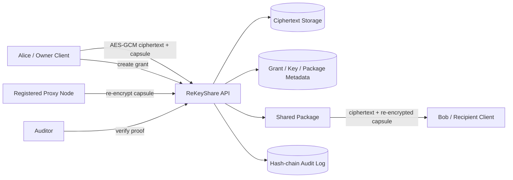

# ReKeyShare

> 面向半可信云存储与代理节点的数据安全共享系统原型。


ReKeyShare 是一个用 Java 实现的数据安全共享系统原型。项目围绕“数据拥有者将密文托管到半可信存储，授权接收方通过代理重加密获得访问能力”的场景，提供客户端侧加密上传、对象级授权、代理节点治理、授权撤销、内容密钥轮换、可验证审计与安全测试报告等完整工程能力。

项目中的 `RSA_PRE` 与 `ECC_PRE` 明确定位为教学型 baseline 和对照实验实现，不作为生产级密码安全承诺。升级后的 `CryptoProvider` 适配层增加了 `SECURE_ENVELOPE_V1`（JCA P-256 ECDH + HKDF-SHA256 + AES-256-GCM）作为直接接收方封装候选路径；它不冒充 PRE 代理转换协议。生产路径的核心边界是：服务端保存密文、nonce、AAD、capsule 与验证元数据，不保存用户明文、DEK 明文或用户私钥。

## 目录

- [核心场景](#核心场景)
- [系统架构](#系统架构)
- [安全模型](#安全模型)
- [功能亮点](#功能亮点)
- [快速开始](#快速开始)
- [运行模式](#运行模式)
- [API 概览](#api-概览)
- [测试与报告](#测试与报告)
- [项目结构](#项目结构)
- [文档索引](#文档索引)
- [当前边界与路线图](#当前边界与路线图)
- [上游与原创性说明](#上游与原创性说明)

## 核心场景

ReKeyShare 使用 Alice、Bob、Proxy 与审计管理员四类角色来刻画安全共享流程：

1. Alice 在客户端生成数据密钥 DEK，并使用 AES-GCM 加密文件正文。
2. Alice 将密文、nonce、AAD、capsule 和元数据提交到服务端。
3. Alice 为 Bob 创建带策略约束的授权 `ShareGrant`。
4. 经过注册且处于 `ACTIVE` 状态的 Proxy 只转换 capsule，不接触明文、DEK 或用户私钥。
5. Bob 下载共享包，在客户端侧解封装 DEK 并完成正文解密。
6. Charlie 猜测 `dataId`、`grantId`、`packageId` 或跨租户对象时，会被对象级授权拒绝。
7. Alice 撤销授权后，旧 package 被失效；需要强撤销时，由 owner-side rotation 生成新密文版本。
8. 关键操作写入 hash-chain audit log，并可导出审计 proof 供复核。

## 系统架构



核心分层如下：

| 层次 | 主要职责 | 代表模块 |
| --- | --- | --- |
| API 层 | 路由、认证、错误响应、幂等与限流 | `ReKeyShareApplication` |
| 领域服务 | 上传、授权、重加密、撤销、审计 | `service/*` |
| 密码适配 | AEAD、baseline PRE、KDF、hash | `crypto/*` |
| 模型层 | 用户、数据、授权、共享包、审计事件 | `model/*` |
| 存储层 | In-memory 演示适配、JDBC 治理元数据/审计适配、快照导出 | `storage/*`、`schema.sql` |
| 测试与报告 | 安全测试、攻击测试、性能基准、实验输出 | `src/test/*`、`docs/reports/*` |

## 安全模型

ReKeyShare 的安全设计围绕“服务端可托管密文和元数据，但不应成为明文保管者”展开。

### 已强制的边界

- 正式上传接口为 `/api/data/upload-encrypted`，接收客户端侧加密后的密文材料。
- 默认运行模式为 `PRODUCTION`，不会注册 demo 明文解密路由。
- `/api/shared-packages/{packageId}` 只返回密文、nonce、AAD 与 re-encrypted capsule，不返回 plaintext。
- 核心业务模型不保存 plaintext 或 plaintext-derived demo hash。
- `ObjectAuthorizationService` 对 data、grant、package 执行主体、对象、动作三元校验。
- Proxy 调用重加密接口时必须同时满足 `PROXY` 角色和 `ACTIVE` 节点状态。
- AES-GCM nonce 通过 `(key fingerprint, nonce)` 注册表检测复用，并提供数据库唯一约束设计。
- 审计日志使用 hash chain，并通过 proof service 输出 chain root、Merkle root 与签名检查点。

### 明确不承诺的内容

- `RSA_PRE` common modulus 与当前 `ECC_PRE` 都不是生产级 PRE 协议。
- 授权撤销不能追回接收方已经离线保存的旧明文。
- 内置 token 服务用于 demo 和课程实验，不等价于完整 OIDC、OAuth2、mTLS 或企业 IAM。
- 默认 HTTP 服务器使用 In-memory repository 以保持演示可复现；`JdbcGovernanceRepository` 与 `JdbcAuditRepository` 已提供恢复、撤销事务和原子限次验证，部署装配仍需配套对象存储、KMS/HSM 与集中审计系统。

更多细节见 [docs/SECURITY_DESIGN.md](docs/SECURITY_DESIGN.md)、[docs/CRYPTO_SCHEME.md](docs/CRYPTO_SCHEME.md) 与 [docs/THREAT_MODEL.md](docs/THREAT_MODEL.md)。

## 功能亮点

| 能力 | 说明 |
| --- | --- |
| 客户端侧加密上传 | `/api/data/upload-encrypted` 保存密文材料，服务端不保留用户明文 |
| AES-GCM 数据保护 | 支持 nonce 复用检测、AAD 绑定、ciphertext hash 与 chunked encryption 组件 |
| 密码适配层 | `SchemeDescriptor` 明示 baseline/proof 状态；production 默认选择不得仅为 baseline |
| 安全封装路径 | `SECURE_ENVELOPE_V1` 使用 JCA 原语并通过上下文篡改测试 |
| PRE baseline | 保留 RSA/ECC 两条教学型代理重加密路径，便于流程验证和性能对照 |
| ECC recipient-share 流程 | 使用 session、challenge、过期时间与签名校验约束接收方份额提交 |
| 对象级授权 | 对 dataId、grantId、packageId 等对象执行统一访问控制 |
| 授权策略 | 支持过期时间、访问次数、重加密次数、下载次数、动作集合与 policy hash |
| 撤销与轮换 | grant revoke 会失效相关 package；owner-side rotation 用新密文版本替换旧授权面 |
| 代理节点治理 | 代理节点可注册、撤销，并与 token 身份、租户范围绑定 |
| 可验证共享包 | `SharedPackageV2` 固化签发 manifest，绑定 ciphertext/AAD/capsule/policy/key version |
| 流式验证 | chunk decrypt/verify 与 Merkle root，实验覆盖 100MB 输入 |
| 可验证审计 | hash-chain audit log、tamper detection、proof export 与 JDBC 重启验证 |
| API 加固 | Bearer token、统一错误响应、请求体大小限制、幂等键、基础限流 |
| 代理治理 | 节点状态、tenant 范围、scheme 白名单与 quota |
| 持久化设计 | JDBC 治理元数据与 audit 可重启恢复；100 并发限次通过原子更新证明不超发 |
| 实验报告 | 一条命令生成 raw/summary，覆盖 secure envelope、baseline、流式、篡改与 threshold prototype |

## 快速开始

### 环境要求

- JDK 17 或更高版本
- Maven 3.9 或更高版本，用于运行完整测试和质量检查
- Docker 可选，用于容器化启动

### 使用 Maven

```powershell
mvn test
mvn exec:java -Dexec.mainClass=com.example.pre.app.ReKeyShareApplication
```

启动后访问：

- API 状态页：`http://localhost:8080/`
- OpenAPI 摘要：`http://localhost:8080/openapi.json`
- 审计验证入口：`http://localhost:8080/api/audit/verify`

### 不依赖 Maven 的本地编译

```powershell
$files = Get-ChildItem -Recurse -Path src\main\java -Filter *.java
javac -encoding UTF-8 -d target\classes $files.FullName
java -cp target\classes com.example.pre.app.ReKeyShareApplication 8080
```

### 使用 Docker Compose

```powershell
docker compose up --build
```

`docker-compose.yml` 会将 `storage` 与 `docs/reports` 挂载到容器内，方便保留快照、nonce registry 与实验报告。

## 运行模式

ReKeyShare 区分生产边界和 demo 演示边界。

| 模式 | 启动方式 | 行为 |
| --- | --- | --- |
| `PRODUCTION` | 默认模式 | 只注册正式密文接口；demo 明文上传与 demo 解密接口不可用 |
| `DEMO` | `-Drekeyshare.profile=demo` 或 `REKEYSHARE_PROFILE=demo` | 启用课程演示接口，便于端到端正确性验证 |

生产模式：

```powershell
java -cp target\classes com.example.pre.app.ReKeyShareApplication 8080
```

Demo 模式：

```powershell
java -Drekeyshare.profile=demo -cp target\classes com.example.pre.app.ReKeyShareApplication 8080
```

Demo 模式会启用 `/api/data/upload` 和 `/api/demo/shared-packages/{packageId}/decrypt`。这些接口只用于教学演示和测试正确性，不应出现在生产安全承诺中。

## API 概览

完整路径可从 `/openapi.json` 查看。下面的 baseline 全链路用于以 `DEMO` profile 运行的教学/正确性验证；`PRODUCTION` 只持久化注册用户的公钥材料，支持客户端侧加密上传，但正式 rekey/解封装须由客户端或 KMS 集成提供，不会让服务端代持用户私钥。

### 1. 创建用户并获取 token

```powershell
curl -X POST http://localhost:8080/api/users `
  -H "Content-Type: application/json" `
  -d '{"userId":"alice","role":"OWNER","algorithm":"ECC_PRE"}'
```

响应会返回 `token`。后续正式接口使用：

```http
Authorization: Bearer <token>
```

在 `PRODUCTION` 中该注册过程落库的 key material 不含 private key；服务端生成/轮换私钥的演示行为仅在 `DEMO` 中可用。

### 2. 上传客户端侧加密数据

```powershell
curl -X POST http://localhost:8080/api/data/upload-encrypted `
  -H "Authorization: Bearer <alice-token>" `
  -H "Content-Type: application/json" `
  -H "Idempotency-Key: upload-demo-001" `
  -d '{
    "algorithm":"ECC_PRE",
    "fileName":"contract.pdf",
    "contentType":"application/pdf",
    "encryptedContent":"<base64-ciphertext>",
    "contentNonce":"<base64-nonce>",
    "aad":"<base64-aad>",
    "capsuleHeader":"<base64-header>",
    "wrappedKey":"<base64-wrapped-key>",
    "keyNonce":"<base64-key-nonce>",
    "originalSize":"4096"
  }'
```

服务端返回 `dataId`、`contentKeyVersion` 与 `ciphertextHash`，不会返回明文。

### 3. 创建授权

```powershell
curl -X POST http://localhost:8080/api/grants `
  -H "Authorization: Bearer <alice-token>" `
  -H "Content-Type: application/json" `
  -d '{
    "dataId":"<data-id>",
    "recipientId":"bob",
    "maxAccessCount":"5",
    "maxDownloadCount":"3",
    "expiresInSeconds":"604800",
    "allowedActions":"download,decrypt",
    "purpose":"case-sharing"
  }'
```

ECC 授权还可使用 `/api/rekey-sessions`、`/api/rekey-sessions/{sessionId}/recipient-share` 与 `/api/grants/ecc` 完成 recipient-share 工作流。

### 4. 代理重加密

```powershell
curl -X POST http://localhost:8080/api/proxy/re-encrypt `
  -H "Authorization: Bearer <proxy-token>" `
  -H "Content-Type: application/json" `
  -d '{"grantId":"<grant-id>"}'
```

代理只获得 `packageId`，不获得用户明文或数据密钥。

### 5. 接收方下载共享包

```powershell
curl http://localhost:8080/api/shared-packages/<package-id> `
  -H "Authorization: Bearer <bob-token>"
```

响应包含 ciphertext、nonce、AAD 与 re-encrypted capsule。Bob 需要在客户端侧完成 decapsulate 和 AES-GCM 解密。

### 6. 撤销与审计

```powershell
curl -X POST http://localhost:8080/api/grants/<grant-id>/revoke `
  -H "Authorization: Bearer <alice-token>"

curl http://localhost:8080/api/audit/proof `
  -H "Authorization: Bearer <admin-token>"
```

撤销会阻断未来访问并失效相关 package；审计 proof 可用于复核事件链完整性。

## 测试与报告

常用验证入口：

```powershell
mvn test
java -cp target\classes com.example.pre.app.SelfTestApplication
java -cp target\classes com.example.pre.app.AuditTamperApplication
java -cp target\classes com.example.pre.app.BenchmarkApplication
powershell -ExecutionPolicy Bypass -File scripts\run-all-experiments.ps1
```

测试与实验资料位于：

| 路径 | 内容 |
| --- | --- |
| [docs/reports/L0-L10-test-report.md](docs/reports/L0-L10-test-report.md) | L0 到 L10 实验任务、指标与原始输出索引 |
| [docs/reports/raw](docs/reports/raw) | 各项实验保留的原始 json、txt、csv 输出 |
| [docs/reports/security-review-24-fixes.md](docs/reports/security-review-24-fixes.md) | 24 项安全审查问题的处理记录 |
| [docs/reports/raw](docs/reports/raw) | 分项实验原始 CSV/JSON 与历史原始输出 |
| [docs/reports/summary](docs/reports/summary) | 本轮可复现实验分析报告 |
| [docs/reports/raw/e06-revocation-results.json](docs/reports/raw/e06-revocation-results.json) | 撤销、包失效与 key version 轮换证据 |
| [docs/reports/raw/e10-persistence-recovery-results.json](docs/reports/raw/e10-persistence-recovery-results.json) | JDBC 重启恢复与原子限次证据 |
| [docs/reports/raw/e14-performance-gate-results.json](docs/reports/raw/e14-performance-gate-results.json) | 保留基线对当前 p95 的性能门禁 |
| [docs/reports/performance-results.csv](docs/reports/performance-results.csv) | 升级前保留的 RSA/ECC baseline 基线数据 |
| [storage/exports/rekeyshare-snapshot.json](storage/exports/rekeyshare-snapshot.json) | 存储快照导出样例 |

Maven 配置中包含 JUnit 5、JaCoCo、SpotBugs 与 OWASP dependency-check，可用于持续质量检查。

## 质量门禁与复现

质量门禁脚本位于 [scripts](scripts)：

- `check-security-boundary.ps1`：生产边界扫描，确保无明文泄露。
- `check-performance-budget.ps1`：p95 性能回归阈值检查。
- `check-doc-links.ps1`：文档链接一致性检查。

完整门禁与 CI 说明见 [docs/ops/ci-quality-gates.md](docs/ops/ci-quality-gates.md)。

## 贡献指南

贡献流程与质量要求见 [CONTRIBUTING.md](CONTRIBUTING.md)。

## 安全问题反馈

安全问题披露流程见 [SECURITY.md](SECURITY.md)。

## 许可证

本项目采用 MIT License，详见 [LICENSE](LICENSE)。

## 项目结构

```text
.
├── src/main/java/com/example/pre
│   ├── app                 # API 服务、自测、审计篡改演示、benchmark 入口
│   ├── crypto              # AES-GCM、KDF、hash、RSA/ECC PRE baseline
│   ├── model               # 用户、数据、授权、共享包、审计等领域模型
│   ├── service             # 上传、授权、代理、撤销、审计、密钥管理服务
│   ├── storage             # Repository 接口、内存实现、JDBC audit/governance adapter
│   └── util                # AAD、JSON、日志脱敏、计时等工具
├── src/main/resources/db   # 数据库表结构设计
├── src/test/java           # 单元测试、攻击测试、场景测试、性能测试
├── docs                    # 设计文档、安全模型、技术方案、测试报告
├── demo                    # 演示数据与预期输出
├── storage                 # 本地运行生成的 nonce registry 与快照
├── Dockerfile
├── docker-compose.yml
└── pom.xml
```

## 文档索引

- [docs/doc-index.md](docs/doc-index.md)：升级后完整文档导航。
- [docs/traceability-matrix.md](docs/traceability-matrix.md)：需求到代码、测试、报告的追踪矩阵。
- [docs/architecture/system-architecture.md](docs/architecture/system-architecture.md)：分层、数据流和信任边界。
- [docs/package-format/v2.md](docs/package-format/v2.md)：可验证共享包 V2 格式。
- [docs/experiments/experiment-design.md](docs/experiments/experiment-design.md)：复现实验与输出路径。
- [docs/storage/repository-design.md](docs/storage/repository-design.md)：事务化元数据、恢复与运行装配边界。
- [docs/SECURITY_DESIGN.md](docs/SECURITY_DESIGN.md)：正式安全边界、客户端侧加密、共享路径、撤销与审计。
- [docs/CRYPTO_SCHEME.md](docs/CRYPTO_SCHEME.md)：密码方案定位、baseline 限制与生产替换要求。
- [docs/THREAT_MODEL.md](docs/THREAT_MODEL.md)：威胁模型、攻击面与防护目标。
- [docs/TECHNICAL_PLAN.md](docs/TECHNICAL_PLAN.md)：工程路线、模块拆分与后续增强计划。
- [docs/design/api-design.md](docs/design/api-design.md)：API 设计说明。
- [docs/design/security-boundary.md](docs/design/security-boundary.md)：生产与 demo 边界说明。
- [docs/UPSTREAM_NOTICE.md](docs/UPSTREAM_NOTICE.md)：上游关系与原创性边界说明。

## 当前边界与路线图

ReKeyShare 目前适合作为数据安全共享系统的课程、竞赛和研究型原型，重点展示“密文托管、授权转换、撤销审计和攻击验证”的完整闭环。

下一阶段更接近生产系统的工作包括：

- 将 `RSA_PRE`、`ECC_PRE` baseline 替换为经过公开审查的 HPKE、Threshold PRE 或 Umbral-style 实现。
- 接入 OIDC、OAuth2、mTLS 或企业 IAM，替换内置 demo token。
- 将私钥、DEK、KEK 与签名密钥迁移到 KMS、HSM 或客户端安全容器。
- 在生产 HTTP 装配中启用仓库已提供的 JDBC 治理/审计 adapter，并落实对象存储、迁移与备份恢复运维。
- 引入跨实例 nonce 分配、集中速率限制、WORM 审计锚定和远程时间戳服务。
- 完善大文件分片上传、断点续传、chunk manifest 校验和端到端并发压测。

当前仓库已经实现 chunk 解密/校验、100MB 实验 runner、package V2 与单实例并发限次验证；生产部署仍需落地多实例事务 repository、外部 audit anchor、企业 IAM 与 KMS/HSM。

## 上游与原创性说明

如果仓库历史显示 fork 来源，应保留上游声明与许可证信息。当前 ReKeyShare 的安全加固工作集中在对象级授权、生产与 demo profile 分离、客户端侧加密上传、撤销与轮换、审计 proof、代理节点治理、nonce registry、持久化表设计和安全测试报告等模块。

详见 [docs/UPSTREAM_NOTICE.md](docs/UPSTREAM_NOTICE.md)。
