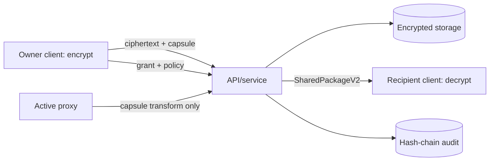

# 系统架构

## 场景与信任边界

Owner 客户端生成 DEK 并加密正文；服务端仅托管 ciphertext、nonce、AAD、capsule、授权状态与审计材料；Proxy 只转换 baseline capsule；Recipient 在客户端解封装并解密。存储端和 Proxy 均按半可信处理，不能接触文件明文、明文 DEK 或用户私钥。

## 分层

| 分层 | 实现 | 安全职责 |
| --- | --- | --- |
| API | `app/ReKeyShareApplication` | profile、认证、trace/error、body limit、幂等 |
| 服务 | `service/*` | 授权、撤销、package 验证、审计、状态迁移 |
| 密码 | `crypto/*` | AES-GCM、provider、baseline、secure envelope、threshold prototype |
| 模型 | `model/*` | grant、package V2、manifest、proxy/key 状态 |
| 存储 | `storage/*`, `resources/db/schema.sql` | nonce 唯一约束、repository 边界 |

`CryptoProvider` 将算法描述与业务边界分离；服务层不应把 baseline 的存在解释为 production 安全承诺。
